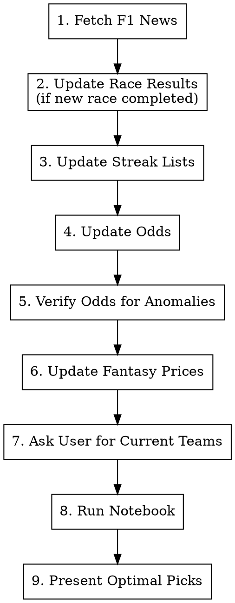

# F1 Race Update

End-to-end workflow for updating the F1 Fantasy model before each race weekend.

## Workflow



## Step 1: Fetch F1 News

Search the web for recent F1 news relevant to the upcoming race:
- Driver injuries, penalties, or grid drops
- Weather forecast for the race weekend
- Car upgrades or performance changes
- Any DNS/DNF-affecting news (PU penalties, crashes in practice)

Summarize findings that could affect model inputs (e.g., "Verstappen has a 5-place grid penalty" means odds may not reflect true race pace).

## Step 2: Update Race Results

**Only if a new race has completed since the last update.**

1. Run `update_f1db.py` (ensure year list includes `2026`):
   ```bash
   .venv/bin/python update_f1db.py
   ```

2. Update cell 25 in the notebook — add new race href and increment `season_length`:
   ```python
   hrefs = [
       "1279/australia",   # R1
       "1280/china",       # R2
       "1281/japan",       # R3  <- add new race
   ]
   season_length = 3  # <- increment
   ```
   Find the race ID from `https://www.formula1.com/en/results.html/2026/races.html`.

3. Use `nbformat` to edit the notebook cell (never `json.dump`).

## Step 3: Update Streak Lists

Edit cell 2 of the notebook. Streak rules:
- **Q3 streak**: Driver qualified in Q3 (top 10) in BOTH of the last 2 races
- **Race streak**: Driver finished in top 10 in BOTH of the last 2 races
- Same logic for constructor streaks (both drivers combined)

Check recent qualifying and race results to determine current streaks. Update these lists:
```python
q_streak_drivers = [...]
race_streak_drivers = [...]
q_streak_teams = [...]
race_streak_teams = [...]
```

## Step 4: Update Odds

Run the notebook's Oddschecker scraper by executing:
```bash
.venv/bin/python run_notebook.py
```

Or if scraping manually: update `odds_2026.csv` with fresh odds from Oddschecker for markets: winner, podium-finish, top-6-finish, points-finish, fastest-lap.

The scraper auto-detects the current race from `RACE_CALENDAR` by date.

## Step 5: Verify Odds for Anomalies

**CRITICAL** — Read `odds_2026.csv` after scraping and check for:
- Heavy favorites showing extremely high odds (e.g., 501.0) — scraper sometimes misses them
- Any driver with winner odds lower than top3 odds (impossible)
- DNF values that seem wrong for the team tier
- Compare against the previous race's odds for dramatic unexplained shifts

Present the odds table to the user and ask them to confirm or flag corrections.

## Step 6: Update Fantasy Prices

The notebook's price scraper (cell 34) runs automatically. After notebook execution, verify `_prices.csv`:
- Constructor prices should be $5-30M range
- Driver prices should be $4-29M range
- No missing drivers/constructors

If the scraper failed (common), ask the user to check `fantasy.formula1.com` and update `_prices.csv` manually.

## Step 7: Ask User for Current Teams

Ask the user to paste a screenshot of their current F1 Fantasy teams from the app/website. From the screenshot, extract:
- 5 drivers + 2 constructors per team
- Remaining budget / cost cap
- Available transfers
- Current turbo driver selection

Update cell 38 `TEAMS_PORTFOLIO` in the notebook:
```python
TEAMS_PORTFOLIO = [
    {
        'name': 'T1 Team Name',
        'drivers': ['Driver1', 'Driver2', 'Driver3', 'Driver4', 'Driver5'],
        'constructors': ['Constructor1', 'Constructor2'],
        'transfers': N,
        'cost_cap': X.X,
    },
    # ... repeat for each team
]
```

Use exact driver last names matching the model (e.g., `'Antonelli'` not `'Andrea Kimi Antonelli'`).

## Step 8: Run Notebook

```bash
.venv/bin/python run_notebook.py --skip-scraper
```

Use `--skip-scraper` if odds were already verified/fixed in step 5. Watch for:
- Cell execution errors (especially scraper cells, Gurobi solver)
- Warnings about missing data

## Step 9: Present Optimal Picks

After successful execution, read the notebook output cells and present:

1. **Top EV Drivers** — table with Driver, EV, Price, EV/$M
2. **Top EV Constructors** — table with Constructor, EV, Price, EV/$M
3. **Per-team optimization** — for each team in TEAMS_PORTFOLIO:
   - Recommended transfers (who to drop, who to pick up)
   - Optimal turbo selection
   - Expected EV gain from transfers
4. **Budget range table** — optimal teams at $95-$100M budgets
5. **Key insights** — any surprising picks, value opportunities, or risks from the news

## Common Issues

| Problem | Fix |
|---------|-----|
| Oddschecker scraper blocked by Cloudflare | Use `--skip-scraper`, update `odds_2026.csv` manually |
| Price scraper returns stale data | Check `fantasy.formula1.com` directly, update `_prices.csv` |
| Gurobi license error | Ensure `GRB_LICENSE_FILE` env var is set |
| F1.com results page changed format | Check column names: `Pos.`, `Team`, `Time / Retired` |
| Notebook kernel not found | Run from `.venv`: `.venv/bin/python run_notebook.py` |
